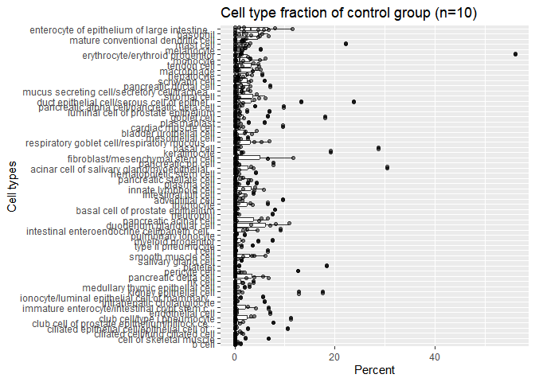
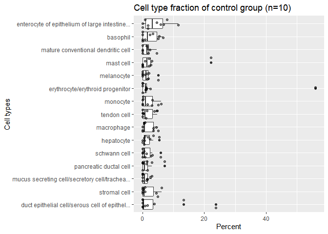

Thien’s casual notes on dealing with various transcriptomic analyses in
R (for the BMEX paper)
================
miti
2024-03-04

- [Introduction](#introduction)
- [Downloading and processing RNA-seq data from NCBI Sequence Read
  Archive](#downloading-and-processing-rna-seq-data-from-ncbi-sequence-read-archive)
  - [Prerequisites](#prerequisites)
  - [Prefetching and processing SRA
    files](#prefetching-and-processing-sra-files)
  - [Mapping and quantifiying reads from FASTQ
    data](#mapping-and-quantifiying-reads-from-fastq-data)
- [Cell-type deconvolution from RNA-seq
  data](#cell-type-deconvolution-from-rna-seq-data)
  - [Introduction](#introduction-1)
  - [Initial setup](#initial-setup)
  - [Running the deconvolution
    scripts](#running-the-deconvolution-scripts)
  - [Preliminary deconvolution
    results](#preliminary-deconvolution-results)
- [Consensus co-expression network
  analysis](#consensus-co-expression-network-analysis)

## Introduction

Hi. This is my notes on performing various kinds of analyses with
RNA-seq data in R. I do not guarantee good or understandable writing in
this, because this is basically my raw thoughts for documentation
purposes, and possibly for future Brain Health Lab younglings.

Future Thien might make it into a proper tutorial.

## Downloading and processing RNA-seq data from NCBI Sequence Read Archive

I wish it was as simple as clicking a download button, but science is
never simple.

### Prerequisites

- Your preferred command-line environment. I use Windows Subsystem for
  Linux (WSL) because Linux and bash is commonly used in scientific
  computing, so if you don’t have experience might as well learn it now.

- Basic experience with using the terminal.

- **A Ton** of free disk space (~500GBs or more), preferably on fast
  storage such as NVME SSDs because these operations are I/O heavy. HDDs
  might struggle.

- Lots and lots of RAM on your PC (minimum 32GB). If you don’t have this
  much you can ask for permission to use the Brain Health Lab server.

- Go to NCBI SRA and search for the dataset of your choice. For
  reference, here are the BioProject accessions that we are going to
  use: <https://www.ncbi.nlm.nih.gov/bioproject/PRJNA574438/>

### Prefetching and processing SRA files

Install the SRA-tools package from NCBI at the following link:

Go to the BioProject page and fetch the SRA accession list by going to
the Run selector and select download Accession list. A text file called
`SRR_Acc_List.txt` will be downloaded

*By default, `prefetch` will download files to the Home directory. You
might want to change this to whatever directory you want, or use the
current working directory. Do this by running `vdb-config -i` and change
it through the interactive menu.*

Run the command to prefetch all files from the downloaded SRA accession
list file: `prefetch --option-file ./SRR_Acc_List.txt`

This might take over 24 hours (for me it took 18 hours with the Toden
dataset). Just leave it running in the background while you do other
productive or unproductive things.

You will obtain a bunch of .sra files. We will now proceed to converting
them into the format that we need: FASTQ. To do this, we use the
`fasterq-dump` command. In our case, we have 338 SRA files so it will be
nice to set up a script to process them all at once. This step will take
up a lot of space (~2-3 times the original downloaded SRA data). I don’t
have enough disk space to process them all.

I found a package called `parallel-fastq-dump` that seems to be very
helpful.

### Mapping and quantifiying reads from FASTQ data

**To be written**, basically feed it into our original pipeline.

*Sidenote: The popular standard package for alignment seems to be
`salmon` or `kallisto` nowadays. I did not know this when I did the
original cf-RNA paper. But for reproducibility sake I will use our
original pipeline which used `rsubread`.*

## Cell-type deconvolution from RNA-seq data

### Introduction

Cell-free RNA in plasma can represent a broad transcriptome of tissues
around the body, however questions still remain about the role of the
origin cell types of cfRNA transcripts, which can provide a lot of
information into the pathogenesis of AD, maybe leading to a non-invasive
way of studying AD progression.

To answer this question, Vorperian et al. used support vector regression
to deconvolve cell types of origin from the plasma cell-free
transcriptome. The deconvolution process is done by employing [Tabula
Sapiens](https://tabula-sapiens-portal.ds.czbiohub.org/), a
multiple-donor whole-body cell atlas spanning 24 tissues and organs, to
define a basis matrix whose gene set accurately and simultaneously
resolved the distinct cell types in TSP.

They found that platelets, erythrocyte/erythroid progenitors and
leukocytes comprised the majority of observed signal, as well as
observing distinct transcriptional contributions from solid
tissue-specific cell types from the intestine, liver, lungs, pancreas,
heart, and kidney.

We are going to do the same thing to our collected cfRNA data to see if
there is anything interesting. Is there a difference between the cell
type fractions of control and AD patients? Could these differences
indicate any pathological process (e.g. inflammation)?

See reference: Vorperian, S.K., Moufarrej, M.N., Tabula Sapiens
Consortium. et al. Cell types of origin of the cell-free transcriptome.
Nat Biotechnol 40, 855–861 (2022).
<https://doi.org/10.1038/s41587-021-01188-9>

### Initial setup

First you need to install anaconda if you haven’t done so already. If
working with Windows, go to their website and download the installer. If
working in WSL/Linux, go to this link and follow their instructions
<https://conda.io/projects/conda/en/latest/user-guide/install/linux.html>

Clone the github repository from the authors:
(github.com/sevahn/deconvolution). The authors were very very nice
people and made a tutorial on how to do this for common people like us.
Bless them.

Anyway, navigate to the `deconvolve_cfrna_tutorial` folder. Create the
conda environment based on the yml file with something like
`conda env create --file cfrna_deconv.yml`. It will download all the
necessary packages like magic.

### Running the deconvolution scripts

First we need to prepare our cfRNA data. I have prepared a
CPM-normalized count matrix of our data and placed it in the same
folder.Why CPM? Because the Tabula Sapiens dataset that we are going to
use to deconvolve uses CPM units.

Don’t use log-transformed values for this (the authors say so very
clearly and we should listen to them). Also made sure to format it so
that **rows are genes** and **columns are samples**.

Unzip the Tabula Sapiens basis matrix in the same directory that the
authors have prepared for us. (Thanks!)

Edit the `sh_1.py` script file to point to our dataset *In WSL/Linux,
edit files from the command line by using `nano FILENAME`* Execute
`sh_1.py` by typing `python sh_1.py`.It will spit out a .sh script file
for every sample (We got 20 samples so we get 20 script files)

Now, you can try to execute the resulting scripts, but Linux won’t let
you do that yet. You need to set the files to be executable. This
command will set all .sh files in the folder to executable
`chmod +x ./*.sh`

We can finally run the scripts. You can execute them all at once by
doing a for loop `for i in *.sh ; do ./$i ; done` This took about 10
minutes.

It will spit out a folder for each sample containing the data. Edit
`merge2.py` similarly to point to the correct data files. This script
will merge all the sample data into one convenient table. Finally, run
`merge2.py` to get the final cell type fractions located in a fractions
csv file.

### Preliminary deconvolution results

Now that we have obtained the deconvolved fractions, let’s move on to
visualizing the results. First load our necessary libraries.

``` r
library(ggplot2)
library(dplyr)
library(tidyr)
```

We will import the resulting csv file back into R and do some minimal
cleaning. This code is pretty horrible but it will do.

``` r
VAN_fractions<-read.csv("D:/VAN_data/BMEX/BMEX_main/VAN_cfRNA_fractions_05032024.csv")
# Data tidying
VAN_fractions <- VAN_fractions[-c(2,3,4)] #remove some duplicate columns and rows
VAN_fractions <- VAN_fractions[-c(63,64),]
VAN_fractions <-tibble(VAN_fractions)
VAN_fractions<-rename(VAN_fractions, "C"=starts_with("C"), "T"=starts_with("T")) #rename columns for simplicity
```

We will tidy up the data to make analysis easier using the tidyverse
packages. Tidying up here means that we basically pivot the table from a
matrix to a list of observations (i.e. each row represent one sample,
one cell_type, and its fraction)

``` r
tidy_data<-VAN_fractions |>
  pivot_longer( #Pivot the table
    cols= matches("[TC]"),
    names_to = "samples",
    values_to= "fraction"
  ) |>
  mutate(group=if_else(substr(samples,1,1)=="C","control","ad")) |> #Create a grouping variable for later
  rename("cell_type"="X") |> #Rename column X to cell_type
  mutate(percent=fraction*100) # Multiply fraction by 100 to get percentage
```

To visualize the data, we will use possibly the greatest plotting
package ever to be invented, the swiss army knife of plotting:
**ggplot2**. We want to make some boxplots to see the full data
distribution . It would be tempting to make a pie chart, but I took a
casual look at the data table and saw a lot of variance between samples,
so reporting just the mean would be horribly misleading. We will
separate our data into the two groups: control and AD

``` r
control_plot1<-ggplot(filter(tidy_data, group=="control"), aes(x=percent,y=forcats::fct_reorder(cell_type, percent, .fun = median)))+ #sorts by median, descending
  geom_boxplot() + geom_jitter(alpha=0.5)+ #jitter aka add the individual datapoints to see outliers
  scale_y_discrete(label=function(x) stringr::str_trunc(x, 46)) #Truncate cell_type labels
control_plot1 + labs(title="Cell type fraction of control group (n=10)",x="Percent",y="Cell types")
```

<!-- -->

``` r
ad_plot1<-ggplot(filter(tidy_data, group=="ad"), aes(x=percent,y=forcats::fct_reorder(cell_type, percent, .fun = median)))+
  geom_boxplot() + geom_jitter(alpha=0.5)+
  scale_y_discrete(label=function(x) stringr::str_trunc(x, 46)) 
ad_plot1 + labs(title="Cell type fraction of AD group (n=10)",x="Percent",y="Cell types")
```

<!-- -->

That is quite a mess. Let’s make another plot where we zoom in on the
top 15 cell types by median fraction in the cfRNA sample. *warning this
code is pretty horrible right now, i will fix it later*

``` r
# Compute the median
control_median <- tidy_data |>
  filter(group=="control") |>
  group_by(cell_type) |>
  summarize(median_fraction=median(percent)) |>
  arrange(median_fraction)

ad_median <- tidy_data |>
  filter(group=="ad") |>
  group_by(cell_type) |>
  summarize(median_fraction=median(percent)) |>
  arrange(median_fraction)

##horrifically janky code

control_plot_topmed<-ggplot(filter(tidy_data,group=="control",cell_type %in% slice_max(control_median,order_by = median_fraction,n=15)$cell_type),
                            aes(x=percent,y=forcats::fct_reorder(cell_type, percent, .fun = median)))+
  geom_boxplot() + geom_jitter(alpha=0.5)+
  scale_y_discrete(label=function(x) stringr::str_trunc(x, 46))
control_plot_topmed + labs(title="Cell type fraction of control group (n=10)",x="Percent",y="Cell types")
```

<!-- -->

``` r
ad_plot_topmed<-ggplot(filter(tidy_data,group=="ad",cell_type %in% slice_max(ad_median,order_by = median_fraction,n=15)$cell_type),                   aes(x=percent,y=forcats::fct_reorder(cell_type, percent, .fun = median)))+
  geom_boxplot() + geom_jitter(alpha=0.5)+
  scale_y_discrete(label=function(x) stringr::str_trunc(x, 46))
ad_plot_topmed + labs(title="Cell type fraction of AD group (n=10)",x="Percent",y="Cell types")
```

<!-- -->

Well we can see that the data is quite noisy. A lot of samples came back
with zero percent, and there are some high outliers. This might mean
that our input cfRNA data is not high quality enough? (or I messed up
something).

It looks like the composition between the control and AD group is quite
different. Of course it would be improper to conclude anything without
some more proper statistical analyses, so that will be the next step. I
will perform some analysis to determine if there is a statistically
significant difference in composition between control vs. AD plasma.

Once I finish processing the Toden data, I will also test the
deconvolution on their dataset too see if it comes out better.

In addition, Tabula Sapiens does not cover all tissue types, so there
are some potentially missing contributions from other sources. The
authors also tested with the Human Protein Atlas (HPA) RNA consensus
dataset, and narrowed it down further with single-cell seq datasets of
specific tissue, so I should look into doing that next.

## Consensus co-expression network analysis

To be done. I have to process the hundreds of gigabytes of sequencing
data from Toden first.
